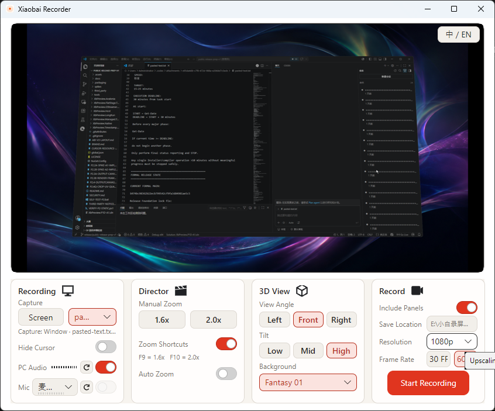
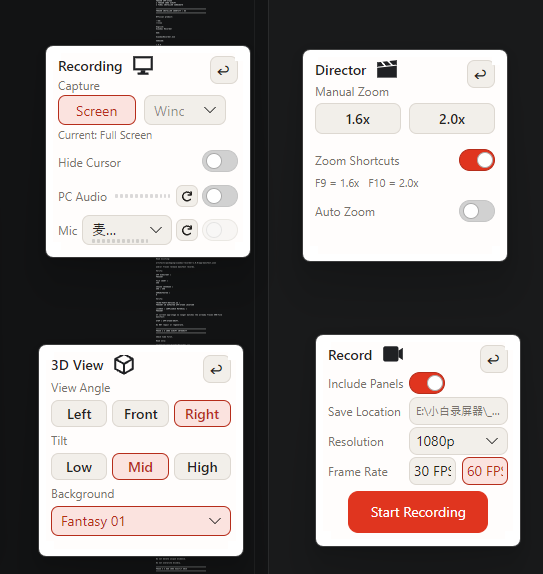
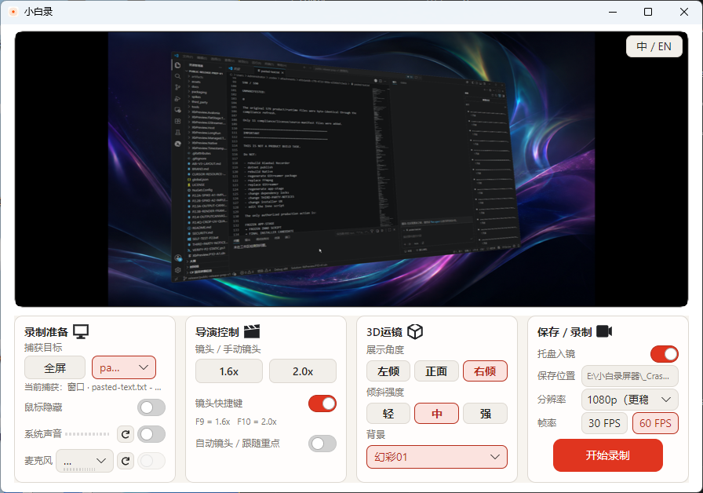

# 小白录 / Xiaobai Recorder

[中文](#中文) | [English](#english)

## 功能展示 / Highlights

### 可拖拽控制面板 / Draggable Control Panels

### 3D 运镜 / 3D Camera Movement

## 中文

小白录是一款开源 Windows 录屏工具，专注于让录制内容无需复杂的编辑流程也能获得整洁、适合展示的成片效果。

它提供录制与演示所需的核心控制，但不是一款完整的视频编辑器。

### 功能

- 录制全屏或指定窗口，并在录制前实时预览画面。
- 分别控制系统声音和麦克风，可选择麦克风，并通过音量表在录制前确认声音输入。
- 隐藏或显示鼠标；使用 1.6×、2.0× 手动镜头与可选的 F9/F10 快捷键，或启用“自动镜头 / 跟随重点”。
- 使用“3D 运镜”调整左倾、正面、右倾和三个强度级别，并选择内置背景或自定义背景图片。
- 将控制面板作为浮动面板使用，并通过“托盘入镜”决定浮动面板是否出现在录制中。
- 开始、暂停、继续、重录和停止录制；选择原始、1080p、2K 或 4K 分辨率以及 30/60 FPS，输出 MP4 文件。
- 简体中文和 English 界面。

### 下载

官方版本通过本仓库的 GitHub Releases 页面发布。首个公开版本面向 64 位 Windows。

#### Windows SmartScreen 与未签名安装程序

当前 v1.0.0 Windows 安装程序尚未进行代码签名。Windows SmartScreen 可能显示“未知发布者”或“Windows 已保护你的电脑”。

请确认安装程序来自本仓库的官方 Releases 页面，并核对该版本发布的 SHA-256 校验值。请勿为安装本软件而关闭安全软件或在系统范围内绕过 SmartScreen。

### 基本使用

1. 选择全屏或指定窗口作为录制目标。
2. 配置系统声音、麦克风、鼠标和演示效果，并通过预览和音量表进行确认。
3. 按需选择保存位置、分辨率、帧率，以及浮动面板是否入镜。
4. 开始录制；过程中可以暂停、继续或选择重录。
5. 停止后，打开已保存的 MP4 视频或其所在文件夹。

### 开源、许可与品牌

源代码采用 [MIT License](LICENSE)。欢迎依照 MIT 许可创建 fork 和衍生产品；“小白录 / Xiaobai Recorder”的官方名称、Logo 和应用图标另见 [品牌说明](BRAND.md)，其规则与源代码许可相互独立。

### 第三方组件

小白录使用第三方开源组件，这些组件各自的许可仍然适用。经审计的完整清单将在 [THIRD-PARTY-NOTICES.md](THIRD-PARTY-NOTICES.md) 中提供。

### 安全

敏感安全问题请按照 [安全政策](SECURITY.md) 私下报告。

### 反馈与 Issue

欢迎通过 GitHub Issues 提交普通 bug 报告和有帮助的反馈；项目不承诺特定响应时间、功能实现或路线图日期。

### 官方与非官方发行

官方二进制文件和版本仅通过本仓库发布。Fork 和衍生产品同样受欢迎，但非官方构建应明确标注为非官方，并使用不同的产品品牌；详见 [品牌说明](BRAND.md)。

## English

Xiaobai Recorder is an open-source Windows screen recorder focused on producing clean, presentable recordings without a complicated editing workflow.

It provides the core controls needed for recording and presentation, but it is not a full video editor.

### Features

- Record the full screen or a selected window, with a live preview before recording.
- Control PC audio and microphone input independently, select a microphone, and confirm audio activity with pre-recording level meters.
- Show or hide the cursor; use 1.6× and 2.0× manual zoom with optional F9/F10 shortcuts, or enable Auto Zoom to follow the focus of activity.
- Use 3D View to select left, front, or right presentation angles at three intensity levels, with built-in or custom image backgrounds.
- Detach controls into floating panels and use Include Panels to choose whether those panels appear in the recording.
- Start, pause, resume, redo, and stop recordings; choose Original, 1080p, 2K, or 4K resolution and 30/60 FPS, with MP4 output.
- Simplified Chinese and English interface languages.

### Download

Official releases are distributed through this repository's GitHub Releases page. The first public release targets 64-bit Windows.

#### Windows SmartScreen and unsigned installer

The current v1.0.0 Windows installer is not code-signed. Windows SmartScreen may show “Unknown Publisher” or “Windows protected your PC.”

Make sure the installer came from this repository's official Releases page and verify the SHA-256 checksum published with that release. Do not disable security software or bypass SmartScreen system-wide to install Xiaobai Recorder.

### Basic use

1. Select the full screen or a window as the recording source.
2. Configure PC audio, microphone, cursor, and presentation options, then confirm them in the preview and level meters.
3. If needed, choose the save location, resolution, frame rate, and whether floating panels are included.
4. Start recording; pause, resume, or choose Redo when needed.
5. Stop, then open the saved MP4 video or its folder.

### Open source, license, and brand

The source code is available under the [MIT License](LICENSE). Forks and derivative products are welcome under the MIT License; the official “小白录 / Xiaobai Recorder” name, logo, and application icon are addressed separately in the [Brand Guidelines](BRAND.md), without changing the source-code license.

### Third-party components

Xiaobai Recorder uses third-party open-source components whose own licenses remain applicable. The complete audited list will be provided in [THIRD-PARTY-NOTICES.md](THIRD-PARTY-NOTICES.md).

### Security

Please report sensitive security issues privately by following the [Security Policy](SECURITY.md).

### Feedback and issues

Ordinary bug reports and useful feedback are welcome through GitHub Issues; the project does not promise a response time, feature implementation, or roadmap date.

### Official and unofficial distributions

Official binaries and releases come only from this repository. Forks and derivatives are welcome, but unofficial builds should be clearly identified as unofficial and use distinct product branding; see the [Brand Guidelines](BRAND.md).
